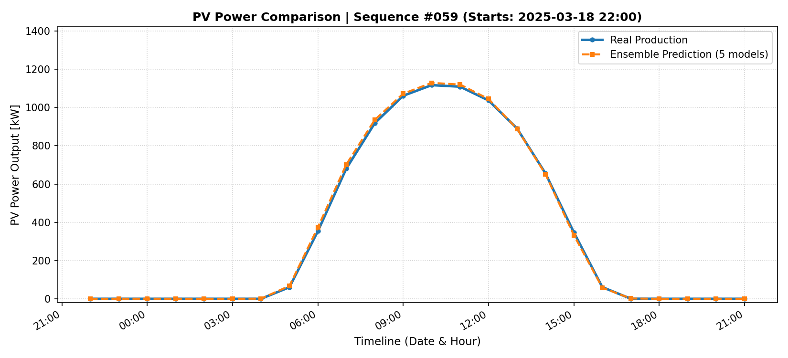

# FVE Day-Ahead Point Power Forecasting

A deep learning project for deterministic (point) forecasting of photovoltaic (PV) power production 24 hours ahead. The model combines historical plant measurements with numerical weather forecasts to predict future power output, targeting applications in energy trading and grid operation.

The forecasting model is based on an Encoder-Decoder architecture with Bahdanau Attention and a production ensemble of multiple independently trained models.

---

## Performance

| Model | Test nMAE |
|-------|----------:|
| Baseline model | ~6.50% |
| Production ensemble | **5.41%** |

*Performance is evaluated on the test set during active production hours (`P > 0 W`) and normalized by the plant's nominal capacity.*

### Model Characteristics

- **Clear-sky conditions:** Stable predictions that accurately reconstruct the daily solar production curve.
- **Variable cloudiness:** The model is trained with L1 loss to produce robust predictions under highly uncertain weather conditions, reducing sensitivity to short-term forecast errors.
- **Physical constraints:** Post-processing clips nighttime production to **0 kW** and limits maximum output to **105%** of the plant's nominal capacity (1293 kW).

---

## Features

- Encoder-Decoder architecture combining CNN, LSTM, and Bahdanau Attention.
- Attention mechanism emphasizing future meteorological forecasts.
- Hyperparameter optimization using Optuna.
- Ensemble learning across multiple random seeds to improve robustness.
- Hyperparameter importance analysis guiding architecture and regularization choices.

---

## Repository Structure

```text
├── data/                     # Preprocessed datasets
├── src/                      # Neural network modules and data loaders
├── ensemble_models/          # Trained ensemble weights and configurations
├── plots/                    # Evaluation plots and Optuna history
├── requirements.txt          # Python dependencies
├── train.py                  # Train a single model
├── train_optuna.py           # Hyperparameter optimization
├── train_ensemble.py         # Train the production ensemble
├── visualize_preds.py        # Prediction visualization
└── run_job.sh                # Remote training script
```

---

## Installation

Clone the repository:

```bash
git clone https://github.com/Kuba129cz/fve-point-prediction.git
cd fve-point-prediction
```

Create and activate a virtual environment:

```bash
python3 -m venv .venv
source .venv/bin/activate
```

Install the required dependencies:

```bash
pip install -r requirements.txt
```

---

## Usage

### Hyperparameter Optimization

```bash
python train_optuna.py
```

### Train the Production Ensemble

```bash
python train_ensemble.py
```

### Evaluation and Visualization

```bash
python visualize_preds_ensemble.py
```

---

## Results

### Example prediction (ensemble vs ground truth)

<p align="center">
  
</p>

## Future Work

This repository concludes the deterministic forecasting stage of the project.

Future work will focus on **probabilistic forecasting**, where the model predicts uncertainty intervals (e.g., 10th and 90th percentiles) instead of a single deterministic forecast. Such forecasts provide valuable information for risk-aware energy trading and decision-making under uncertain weather conditions.